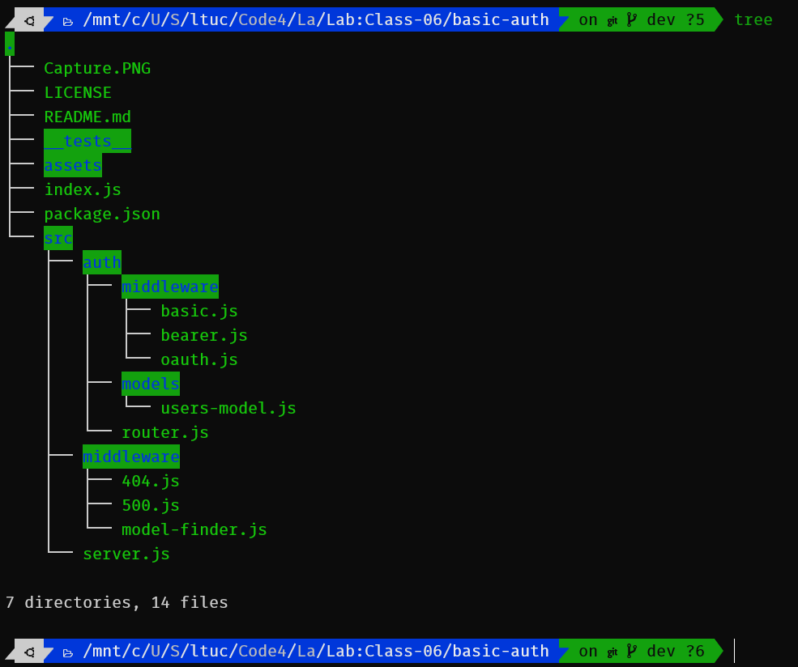

# Lab: Class 06

### Authentication System Phase 1: Deploy an Express server that implements Basic Authentication, with signup and signin capabilities, using a Mongo database for storage

## Phase 1 Requirements

3-Phase build of an authentication system, written in Express. The following core requirements detail the functionality for this phase of the project.

### As a user, I want to create a new account so that I may later login

- Using a tool such as `httpie`, `postman`, or a web form:
  - Make a **POST** request to the`/signup` route with `username` and `password`
  - Your server should support both JSON and FORM data as input
  - On a successful account creation, return a **201** status with the user object in the body
  - On any error, trigger your error handler with an appropriate error

### As a user, I want to login to my account so that I may access protected information

- Using a tool such as `httpie`, `postman`, or a web form:
  - Make a **POST** request to the `/signin` route
  - Send a basic authentication header with a properly encoded username and password combination
  - On a successful account login, return a **200** status with the user object in the body
  - On any error, trigger your error handler with the message "Invalid Login"

## Technical Requirements / Notes

> You have been supplied a "monolithic" express server in the `starter-code` folder which fulfills the above requirements. To complete the work for this phase, refactor the provided server using best practices, modularizing the code and providing tests, as follows:

### Basic Server

- Extract the core server logic into 2 files:
  - `index.js` (entry point)
    - Connect to the database
    - Require the 'server' and start it
  - `server.js` service wiring
    - Exports an express app/server and a start method

### Authentication Modules

Keep your authentication related files in a folder called `/auth` so they are independent of the server itself

- Extract the authentication logic for `/signin` as middleware
  - Create a new node module
  - Interact with the headers and the users model
  - Add the user record (if valid) to the request object and call `next()`
  - Call `next()` with an error in the event of a bad login
- Extract the mongo/schema into a separate module
  - Model the user data
  - Add a pre-save hook in the model ... Before we save a record:
    - Hash the plain text password given before you save a user to the database
  - Create a method in the schema to authenticate a user using the hashed password
- Create a module to house all of routes for the authentication system.
  - Create a POST route for `/signup`
    - Accepts either a JSON object or FORM Data with the keys "username" and "password"
    - Creates a new user record in a Mongo database
    - Returns a 201 with the created user record
  - Create a POST route for `/signin`
    - Use your basic authentication middleware to perform the actual login task
    - `router.post('/signin', basicAuth, (req,res) => {});`
    - When validated, send a JSON object as the response with the following properties:
      - `user`: The users' database record

### Testing

You should manually test your routes using `httpie` from the command line or an application such as Postman or Insomnia.
Additionally, you are required to write automated tests as well:

- POST to /signup to create a new user
- POST to /signin to login as a user (use basic auth)
- Ensure that you use supergoose to test your routes and your database

### Visual Validation

We have deployed a web application that's designed to test your API. This is a good way to ensure that your API works as expected. There's nothing to "turn in" here, this is provided for your benefit.

- Open this [Web Application](https://javascript-401.netlify.app/)
  - Click the "Module 3 (AUTH)" / Basic Auth link
  - In the form at the top of the page, enter the URL to your Authentication Server
  - If your lab is working, this app will show your user record after you login

#### **Routes**

- `/api/signup`
  - Used to create a new user with a password

- `/api/signin`
  - Used to sign in with a user and password

#### **The lab tree**

- 

#### **Testing**

- Successfully add new user
- Successfully sign in as a user
- When use invalid user => Invalid Login: Invalid username or password
- When use invalid password => Invalid Login: Invalid username or password

### **More about the Lab**

- #### Github

  - For the repo ***basic-auth*** clicks => [here](https://github.com/shadykh/basic-auth).
  - Pull Requests:
    - [https://github.com/shadykh/basic-auth/pull/2](https://github.com/shadykh/api-server/pull/2)
    - [https://github.com/shadykh/basic-auth/pull/3](https://github.com/shadykh/basic-auth/pull/3)
  - Actions:
    - [https://github.com/shadykh/api-server/runs/2624684883?check_suite_focus=true](https://github.com/shadykh/api-server/runs/2624684883?check_suite_focus=true)
    - [https://github.com/shadykh/api-server/runs/2624686443?check_suite_focus=true](https://github.com/shadykh/api-server/runs/2624686443?check_suite_focus=true)
    - [https://github.com/shadykh/api-server/runs/2624686951?check_suite_focus=true](https://github.com/shadykh/api-server/runs/2624686951?check_suite_focus=true)
  - Local Tests:
    - 
  - GitHub Tests:
    - 

- #### Heroku

  - For the link of the ***deployment main branch => `/` <= route***  clicks => [here](https://shady-api-server.herokuapp.com/api/favorite/games).

- #### Endpoints

  - `/api/signup` Return JSON objects

  - ```
        [
          {
              "_id": "60aae796f693bd113da75d8f",
              "username": "shady81",
              "password": "$2b$10$wIyjoN8qTKY2e2Ui/N1w/.hvaaW8wagy6Sc4Erh2/mWnkxGotQJ8K",
              "__v": 0
          }
        ]
      ```

  - `/api/signin` Return JSON objects

    - ```
        [
          {
              "_id": "60aae032afe0e10ad32efd5f",
              "username": "shady11",
              "password": "$2b$10$giAP9jC5.84kjcZhp4X22.vZXE2WmBsm.ltvoQE64D/LVWIOcEWG.",
              "__v": 0
          }
        ]
      ```

- #### UML

  - 

- #### Tests

  - run `npm test basic-auth.test.js`
  - Test the routes and statues➡️ [npm test basic-auth.test.js](./__tests__/basic-auth.test.js)

- #### App

  - run `npm start` or `nodmon`
  - visit Herokue depolyed app [here](https://shady-api-server.herokuapp.com/api/favorite/games)

- I did this lab with help of
  - dependencies
    - morgen
    - mongoose
    - cors
    - express
    - dotenv
    - bcrypt
    - base-64
  - devDependencies
    - supertest
    - jest
    - eslint
    - supergoose
  - framework
    - Node.js
  - tools
    - Github.
    - Heroku.
    - VsCode.
    - Ubuntu.
    - atlas mongodb

#### Notes

- SQL vs NoSQL:
  - SQL databases are primarily called as Relational Databases (RDBMS); whereas NoSQL database are primarily called as non-relational or distributed database.
  - SQL databases have predefined schema whereas NoSQL databases have dynamic schema for unstructured data.
    - > for further information clicks => [here](https://www.thegeekstuff.com/2014/01/sql-vs-nosql-db/?utm_source=tuicool)
- Data Model:
  - A data model (or datamodel) is an abstract model that organizes elements of data and standardizes how they relate to one another and to the properties of real-world entities. For instance, a data model may specify that the data element representing a car be composed of a number of other elements which, in turn, represent the color and size of the car and define its owner.
    - > for further information clicks => [here](https://en.wikipedia.org/wiki/Data_model#:~:text=A%20data%20model%20(or%20datamodel,properties%20of%20real%2Dworld%20entities.))
- REST:
  - Representational state transfer (REST) is a software architectural style which uses a subset of HTTP. It is commonly used to create interactive applications that use Web services. A Web service that follows these guidelines is called RESTful. Such a Web service must provide its Web resources in a textual representation and allow them to be read and modified with a stateless protocol and a predefined set of operations.
    - > for further information clicks => [here](https://en.wikipedia.org/wiki/Representational_state_transfer)
- Mongoose:
  - Mongoose is an Object Data Modeling (ODM) library for MongoDB and Node.js. It manages relationships between data, provides schema validation, and is used to translate between objects in code and the representation of those objects in MongoDB.
    - > for further information clicks => [here](https://www.freecodecamp.org/news/introduction-to-mongoose-for-mongodb-d2a7aa593c57/)

- Connection string:
  - In computing, a connection string is a string that specifies information about a data source and the means of connecting to it. It is passed in code to an underlying driver or provider in order to initiate the connection. Whilst commonly used for a database connection, the data source could also be a spreadsheet or text file.
    - > for further information clicks => [here](https://en.wikipedia.org/wiki/Connection_string)
<br>

---
<br>

- ### Shady Khaled github ✅

  - [Shady Khaled](https://github.com/shadykh)

- ### Shady Khaled reading notes 📚

  - [Shady Khaled reading notes](https://shadykh.github.io/reading-notes/)

- ### Shady Khaled portfolio 💬

  - [Shady Khaled portfolio](https://portfolio-shady.herokuapp.com/)
